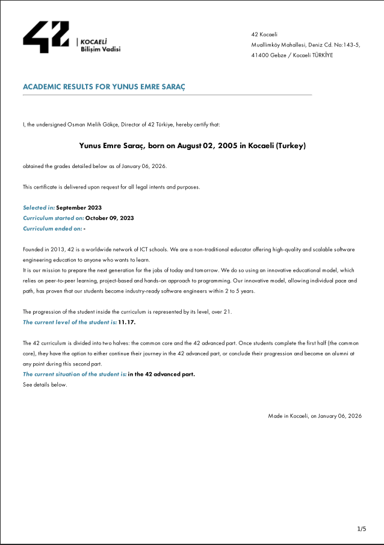
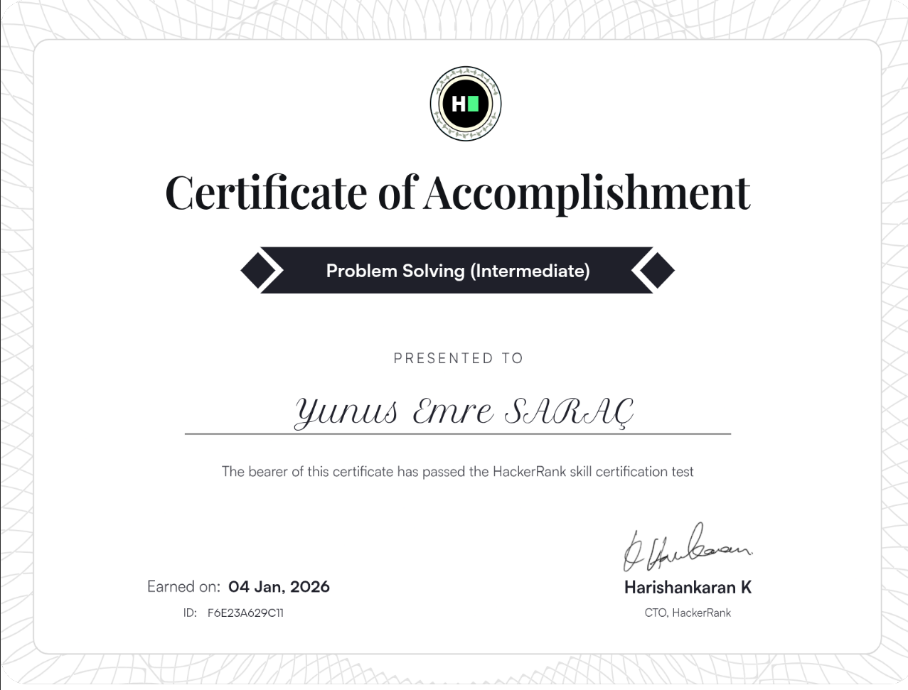
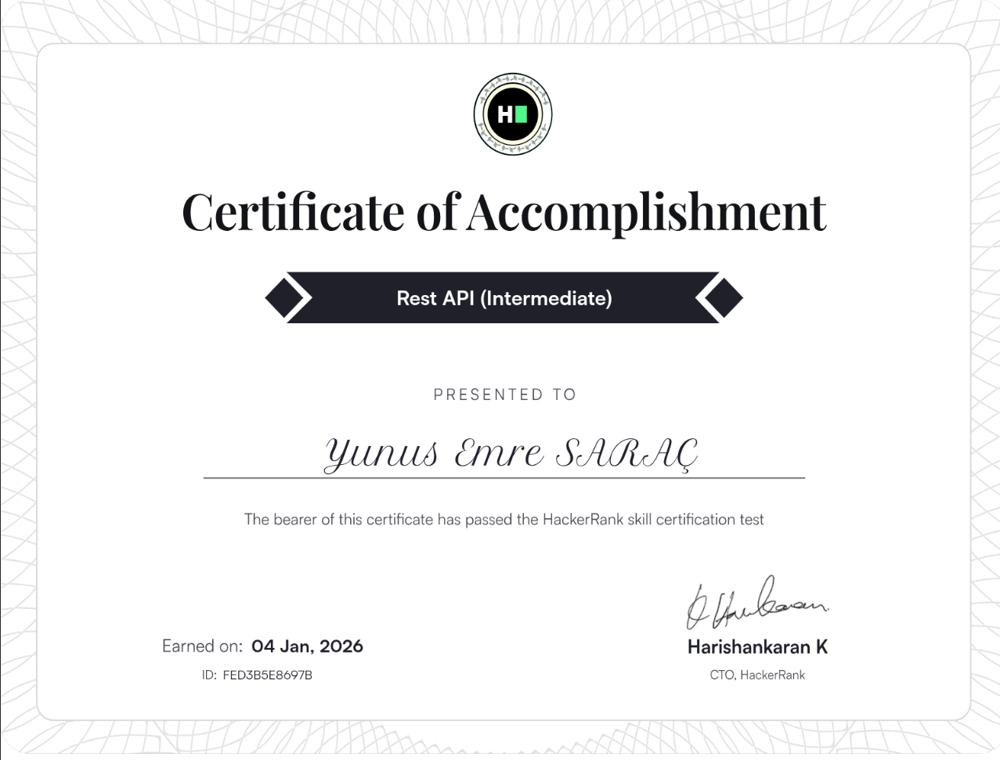
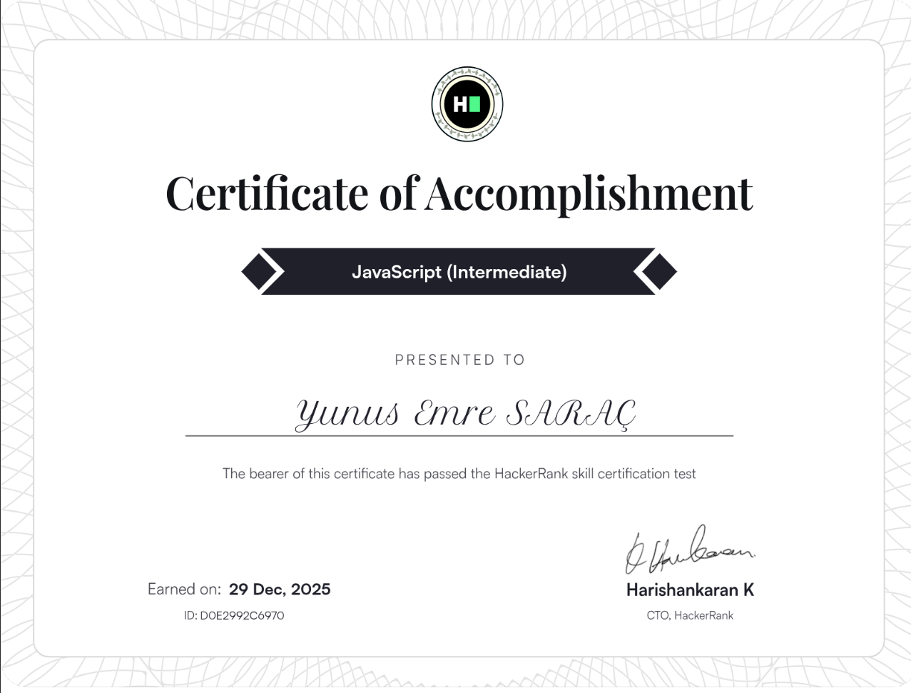
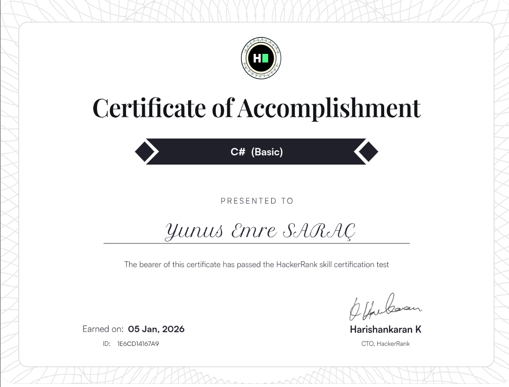
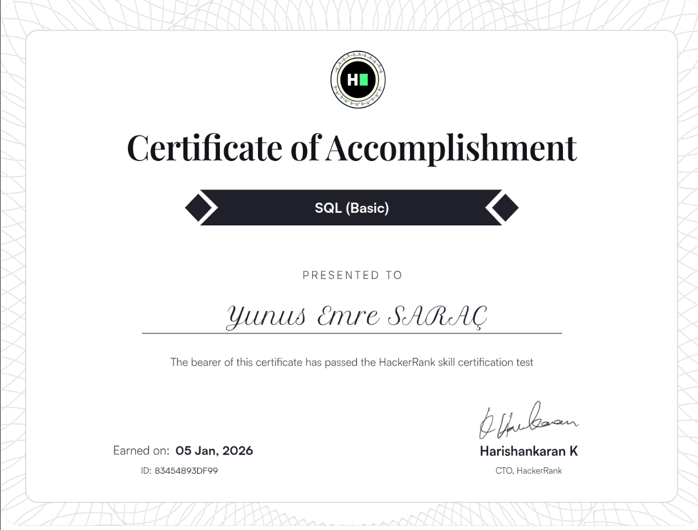

  <h1>Hi there, I'm Yunus Emre SARAÇ! 👋</h1>
  <h3>Software Engineer | Linux Systems & Backend Architecture</h3>
  
  

    <i>"Bridging the gap between low-level embedded logic and high-level microservice architectures."</i>
  

  
  

 

### 👨‍💻 Engineering Profile

I am a **Software Developer** with a rigorous background in **Embedded Systems** and **System Programming**, currently finalizing the Advanced Curriculum at **42 Kocaeli** (Level 11.17).

My engineering approach is defined by deep-diving into **memory management**, **concurrency models**, and **protocol implementation**. Transitioning from manipulating registers on STM32 microcontrollers to orchestrating containerized microservices, I build scalable, secure, and performance-critical software.

* 🔭 **Current Focus:** Microservice orchestration, Cloud Infrastructure, and Advanced Algorithms.
* 🛠️ **Core Competencies:** POSIX Standards, Non-blocking I/O, Hardware-Software Integration, RESTful Architectures.
* 🐧 **System Proficiency:** Linux Kernel Internals (Learning), Debian/Ubuntu Administration, Shell Scripting.

---

### 🛠️ Technical Arsenal

**System & Low-Level**

  
  
  
  
  

**Backend Ecosystem**

  
  
  
  
  

**Infrastructure & Data**

  
  
  
  

---

<h3 align="left">🎓 Education & Academic Status</h3>

<table style="border: none; width: 100%;">
  <tr>
    <td width="250" style="vertical-align: top; padding-right: 20px;">
      <a href="assets/transcript.pdf" target="_blank">
        
         
        
<b>📄 View Official PDF</b>

      </a>
    </td>
    <td style="vertical-align: top;">
      <h3>42 Kocaeli (2023 - Present)</h3>
      

        Currently continuing the <b>Advanced Curriculum</b>.
      

      <ul>
        <li>🚀 <b>Current Level:</b> 11.17</li>
        <li>✅ <b>Common Core:</b> Completed (100%)</li>
        <li>🛠️ <b>Focus:</b> Kernel Development & Cloud Architecture</li>
      </ul>
    </td>
  </tr>
</table>

---
<h3 align="left">📜 Professional Certifications</h3>

<table align="center" style="border: none;">
  <tr>
    <td align="center" width="33%">
      <a href="https://www.hackerrank.com/certificates/f6e23a629c11" target="_blank">
        
         <b>Problem Solving (Intermediate)</b>
      </a>
    </td>
    <td align="center" width="33%">
      <a href="https://www.hackerrank.com/certificates/fed3b5e8697b" target="_blank">
        
         <b>Rest API (Intermediate)</b>
      </a>
    </td>
    <td align="center" width="33%">
      <a href="https://www.hackerrank.com/certificates/d0e2992c6970" target="_blank">
        
         <b>JavaScript (Intermediate)</b>
      </a>
    </td>
  </tr>
  <tr>
    <td align="center" width="33%">
      <a href="https://www.hackerrank.com/certificates/d29372b6c14d" target="_blank">
        
         <b>Node.js (Basic)</b>
      </a>
    </td>
    <td align="center" width="33%">
      <a href="https://www.hackerrank.com/certificates/1e6cd14167a9" target="_blank">
        
         <b>C# (Basic)</b>
      </a>
    </td>
    <td align="center" width="33%">
      <a href="https://www.hackerrank.com/certificates/5ae6ce7c51aa" target="_blank">
        
         <b>SQL (Basic)</b>
      </a>
    </td>
  </tr>
  <tr>
    <td align="center" width="33%">
      <a href="https://www.hackerrank.com/certificates/83454893df99" target="_blank">
        
         <b>Software Engineer</b>
      </a>
    </td>
    <td width="33%"></td>
    <td width="33%"></td>
  </tr>
</table>

---

### 🚀 Key Projects & Implementations

#### 🏓 **ft_transcendence | Microservices Architecture**
*Full-Stack Web Application (SPA)*
> **Tech:** Docker Compose, Fastify (Node.js), PostgreSQL, Nginx, OAuth2.
* Architected a scalable **Microservices** solution using Docker Compose to orchestrate separate containers for Backend, Frontend, and Database.
* Implemented robust security protocols including **JWT Authentication**, **2FA (TOTP)**, and **Refresh Token Hashing**.
* Engineered an **Nginx Reverse Proxy** to manage load balancing and route traffic efficiently between services.
* Integrated strict device verification logic based on **IP/User-Agent fingerprinting**.

#### 🐚 **Minishell | POSIX Compliant Shell**
*System Programming & Process Management*
> **Tech:** C, Unix System Calls, Signal Handling.
* Developed a fully functional custom shell, manually managing memory allocation to prevent leaks (verified with Valgrind).
* Implemented complex process orchestration using `fork`, `execve`, `pipe`, and `dup2` to handle **pipelining** and **redirections**.
* Handled asynchronous **Unix Signals** (SIGINT, SIGQUIT) for stable user interaction.

#### 🌐 **ft_irc | High-Concurrency Server**
*Network Programming (RFC 1459)*
> **Tech:** C++, TCP/IP Sockets, I/O Multiplexing.
* Built a multi-client IRC server utilizing **Non-blocking I/O** and **I/O Multiplexing** (`poll()` syscall) to handle multiple simultaneous connections on a single thread.
* Parsed and processed raw byte streams to ensure full compliance with the **RFC 1459** protocol standard.

#### 📡 **Embedded Communication Systems**
*Internship Project @ GESISTEK*
> **Tech:** C, STM32, Modbus, UART, SPI.
* Developed optimized C libraries for **STM32** microcontrollers to handle industrial data reading via **Modbus**.
* Implemented low-level hardware communication protocols (**SPI/UART**) and managed **EEPROM** memory operations for persistent data storage.

---